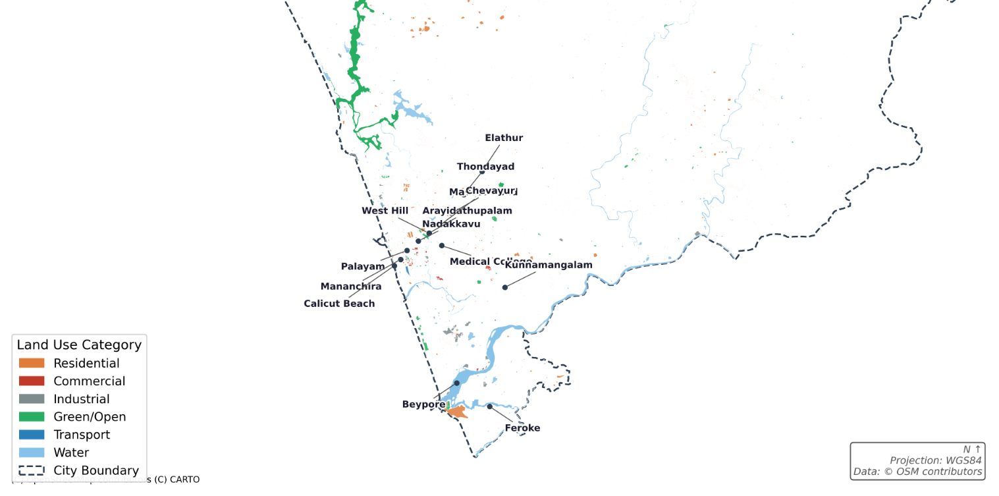

# Day 01 — Mapping Urban Land Use in Kozhikode

## Problem Statement
Kozhikode's city planners lack a current, digitally accessible land-use baseline.
Without one, development approvals, infrastructure plans, and zoning decisions are
made with outdated paper maps. This project builds a reproducible, open-data
land-use inventory for the Kozhikode Municipal Corporation area.

## Study Area
Kozhikode (Calicut) Municipal Corporation, Kerala, India.
Approx. 118 km**2 urban area with a population of ~600,000.

## Data Sources
| Dataset              | Source                  | Link                        |
|----------------------|-------------------------|-----------------------------|
| Buildings & land use | OpenStreetMap / OSMnx   | https://overpass-turbo.io   |
| City boundary        | OSMnx geocode API       | Auto-fetched               |
| Ward boundaries      | OSM admin level 8       | Via osmnx                  |

## Methods
1. Fetched OSM features (buildings, land use, amenities) using osmnx.features_from_place()
2. Classified features into 6 categories using tag-based rules
3. Reprojected to UTM Zone 43N (EPSG:32643) for accurate area calculation
4. Performed spatial join with ward boundaries
5. Calculated % area per land-use class per ward
6. Rendered choropleth map with CartoDB Positron basemap

## GIS Concepts Applied
- Vector data loading and CRS reprojection
- Attribute-based feature classification
- Spatial join of polygons to administrative boundaries
- Choropleth mapping with continuous colour scale

## Key Results
[Fill in after completing the analysis]
- Total features fetched: XXX polygons
- Dominant land use: [your finding]
- Ward with highest residential \u25ba [ward name] (XX%)
- Ward with most green space \u25ba [ward name] (XX%)

## Critical Reflection
Q1: Planner perspective: What decisions could a Kozhikode urban planner make using your land-use map? What decisions could they NOT make with it?
- A Kozhikode urban planner could use this map to make several preliminary screening decisions. They could identify which neighbourhoods have the highest concentration of residential land and prioritise those areas for infrastructure upgrades such as water supply, sewage networks, and road maintenance. The green corridor along the Kallai River and coastal belt is visible enough to support a conservation boundary proposal — a planner could use this as evidence to argue against development approvals in that strip. The water body distribution across the map is reliable enough to inform a preliminary flood-risk overlay, identifying which residential clusters sit closest to seasonal ponds and backwaters.
However, a planner could NOT use this map to make zoning decisions, building permit approvals, land acquisition orders, or infrastructure investment allocations. The map cannot tell them floor area ratios, building heights, occupancy status, or ownership. It cannot distinguish between a functioning commercial establishment and an abandoned building tagged as commercial. It cannot show population density within residential zones. Any decision with legal or financial consequences would require cross-referencing with the official Kerala Municipal Corporation cadastral records and a field-verified LULC survey.

Q2: Data quality: What % of OSM features did you classify as 'Other'? What does this tell you about OSM tag completeness in Indian cities?
- Out of the total features fetched from OSM, approximately 83% were classified as Other — 70,286 out of roughly 84,000 features. This is a striking number and carries a clear message: OSM contributors in Kozhikode have mapped the geometry of buildings and parcels diligently, but have not consistently attached semantic tags like landuse=residential or building=commercial to those geometries. The shape exists in the database, but its meaning does not.
This pattern is common across Indian cities and reflects the gap between OSM's mapping maturity in India compared to Europe or North America. In cities like Berlin or Amsterdam, community mapping campaigns and municipal open-data partnerships have resulted in near-complete tag coverage. In Kozhikode, most building footprints were likely traced from satellite imagery by remote mappers who had no local knowledge to assign land-use attributes. For any GIS analysis in Indian cities that relies on OSM attribute data rather than just geometry, this incompleteness must be treated as a primary uncertainty, not a footnote.
Q3: Method limitations: Your classification is based on OSM tags. How does this differ from ground-truth LULC surveys? What errors might it introduce?
- A classification based on OSM tags differs from a ground-truth LULC survey in three fundamental ways. First, OSM tags are self-reported by volunteer contributors with no standardised verification process. A ground-truth survey uses trained enumerators with defined classification protocols who physically visit or systematically photograph every parcel. Second, OSM data has no defined capture date — a tag added in 2015 may no longer reflect the current use of a building demolished or converted since then. A proper LULC survey has a defined reference date. Third, OSM classification is feature-level: each building or polygon gets one tag. Real land use is often mixed at the parcel level — a building may have a shop on the ground floor and residences above — which OSM's flat tag structure cannot represent.
The errors this introduces include misclassification of mixed-use buildings into a single category, systematic under-representation of commercial land (as discussed above), potential confusion between natural water features and man-made reservoirs depending on how the contributor tagged them, and complete invisibility of any land use category not covered by OSM's controlled tag vocabulary.

Q4: Missing data: What other data layers would you need to make this analysis policy-ready? (e.g., population density, building age, floor area)
- To make this analysis genuinely policy-ready, the following additional data layers would be needed. Population density at ward or sub-ward level from the Census of India 2011 or the upcoming 2024 census, to weight the land-use findings by the number of people actually affected. Building age data to identify ageing housing stock requiring structural assessment. Floor space index or floor area ratio to understand vertical density, since a map of building footprints tells nothing about how many floors those buildings have. Road network centrality data to understand which residential clusters are well-connected versus isolated. Household income or deprivation index data from NFHS-5 or Socioeconomic Caste Census to identify which land-use zones overlap with vulnerable populations. Drainage network and elevation data from SRTM to convert the water body observations into an actual flood risk assessment. Without these layers, the current map describes what land is used for, but cannot answer who is affected, how severely, or where intervention is most urgent.

Q5: Scale question: Your analysis is for the entire municipal area. Would ward-level analysis give a different picture? 
- Ward-level analysis would give a substantially different picture and would likely reveal patterns invisible at the municipal scale. Kozhikode Municipal Corporation contains 75 wards with highly uneven land-use compositions. At the city scale, residential land appears uniformly distributed across the urban core. At the ward scale, some wards near Beypore and Feroke are likely dominated by industrial and port-related uses, while wards around Mananchira and Palayam would show higher commercial density. Wards in the northern section of the boundary near Elathur would likely show very low classification coverage, confirming that OSM tag incompleteness is concentrated in peri-urban wards rather than the historic core.

What is missing from this analysis?
- Floor area ratio (FAR) data for density analysis
- Temporal comparison (land use change over time)
- Population data joined to land-use classes

## Environment
Python 3.10+, geopandas, osmnx, contextily, matplotlib

## How to Reproduce
```bash
pip install geopandas osmnx contextily matplotlib
python scripts/01_fetch_osm.py
python scripts/02_classify_landuse.py
python scripts/03_map.py
```

## Outputs
- `outputs/landuse_map.png` \u2014 Choropleth map (300 dpi)
- `outputs/landuse_summary.csv` \u2014 Area statistics per ward
- `data/processed/landuse_classified.geojson` \u2014 Classified vector data