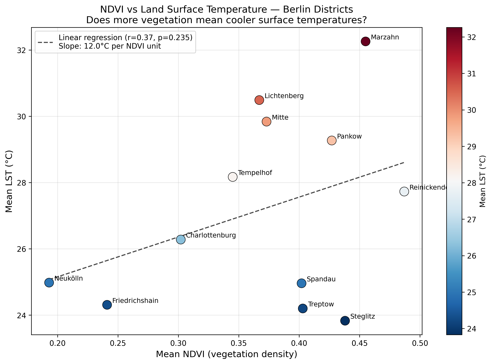

# Day 5 — Urban Heat Island Detection and Mapping in Berlin

## Problem Statement
Berlin's 2018 and 2022 summer heat waves caused excess mortality among elderly residents in inner-city districts. The Berlin Senate Department for Urban Development needs a Land Surface Temperature (LST) map at district level to prioritise green-roof subsidies, street-tree planting, and cool-zone infrastructure in the hottest neighbourhoods. This project builds a reproducible, Landsat-based LST mapping workflow and aggregates surface temperatures to Berlin's 12 administrative districts (Bezirke) to provide an evidence base for climate adaptation investment.

---

## Study Area
- **Region:** Berlin, Germany
- **Administrative Units:** 12 Bezirke (districts)
- **Total Area:** ~892 km²
- **Coordinate Reference System:** EPSG:25833 (UTM Zone 33N)

---

## Data Sources

| Dataset | Source | Format | Access |
|---------|--------|--------|--------|
| Landsat 8 OLI/TIRS Collection 2 Level-2 | USGS via Google Earth Engine | GeoTIFF | Free |
| Berlin District Boundaries (Bezirke) | OpenStreetMap via OSMnx | GeoJSON | Free/Open |

### Landsat Scene Details
| Property | Value |
|----------|-------|
| Scene ID | LC08_194023_20200601 |
| Acquisition Date | 2020-06-01 |
| Cloud Cover | 0.01% |
| Path / Row | 194 / 023 |
| Collection | Collection 2, Level-2 |
| Processing Note | Mosaic used to ensure full Berlin coverage across Landsat paths 193 and 194 |

---

## Methodology

### Step 1 — Environment Setup
Install required Python packages in a virtual environment:
```bash
python -m venv gis_day5_env
source gis_day5_env/bin/activate
pip install geopandas rasterio rasterstats numpy matplotlib seaborn scipy osmnx
```

Install and authenticate Google Earth Engine:
```bash
pip install earthengine-api
earthengine authenticate
```

### Step 2 — Set Up Folder Structure
Run this from your `gis-30day-challenge/` root directory:
```bash
mkdir -p day05_berlin_urban_heat_island/data/raw
mkdir -p day05_berlin_urban_heat_island/data/processed
mkdir -p day05_berlin_urban_heat_island/scripts
mkdir -p day05_berlin_urban_heat_island/outputs
```

### Step 3 — LST and NDVI Retrieval in Google Earth Engine
Open the GEE Code Editor at https://code.earthengine.google.com and run `scripts/01_lst_gee.js`.

This script:
- Defines Berlin's bounding box: `[13.088, 52.338, 13.761, 52.676]`
- Filters Landsat 8 C2L2 to summer months (June-August), cloud cover < 20%
- Creates a mosaic of all valid scenes to ensure full city coverage
- Converts Band ST_B10 to LST in Celsius: `LST(K) = DN × 0.00341802 + 149.0`, then `LST(°C) = LST(K) − 273.15`
- Computes NDVI from SR_B5 (NIR) and SR_B4 (Red) with scale factor 0.0000275
- Exports `lst_berlin.tif` and `ndvi_berlin.tif` at 30m resolution, EPSG:25833 to Google Drive folder `GEE_Exports`

After running, go to the **Tasks tab** in GEE and click **Run** on both export tasks. Wait for green checkmarks (3-5 minutes).

**Download both files from Google Drive and place them in:**
```
data/raw/lst_berlin.tif
data/raw/ndvi_berlin.tif
```

### Step 4 — Download Berlin District Boundaries
Run `scripts/00_get_districts.py` from inside the `day05_berlin_urban_heat_island/` folder:
```bash
cd day05_berlin_urban_heat_island
python scripts/00_get_districts.py
```

This fetches the 12 official Bezirke from OpenStreetMap using OSMnx and saves them to:
```
data/raw/berlin_districts.geojson
```

### Step 5 — Zonal Statistics Per District
Run `scripts/02_lst_analysis.py`:
```bash
python scripts/02_lst_analysis.py
```

This script:
- Loads `data/raw/berlin_districts.geojson` and reprojects to EPSG:25833
- Uses rasterio mask to extract LST and NDVI pixel values within each district polygon
- Computes mean, min, max, std LST and mean NDVI per district
- Saves results to:
  - `data/processed/berlin_districts_lst.geojson`
  - `outputs/uhi_district_stats.csv`

### Step 6 — Generate Maps and Charts
Run `scripts/03_district_stats.py`:
```bash
python scripts/03_district_stats.py
```

Produces:
- `outputs/lst_map.png` — LST raster with Bezirk boundaries + bar chart ranked hottest to coolest

Run `scripts/04_map_chart.py`:
```bash
python scripts/04_map_chart.py
```

Produces:
- `outputs/ndvi_vs_lst_scatter.png` — Scatter plot of NDVI vs LST per district with regression line

---

## File Structure

```
day05_berlin_urban_heat_island/
├── data/
│   ├── raw/
│   │   ├── lst_berlin.tif            # LST GeoTIFF from GEE (Celsius, 30m, EPSG:25833)
│   │   ├── ndvi_berlin.tif           # NDVI GeoTIFF from GEE (30m, EPSG:25833)
│   │   └── berlin_districts.geojson  # 12 Bezirke boundaries from OSMnx
│   └── processed/
│       └── berlin_districts_lst.geojson  # Districts enriched with LST/NDVI stats
├── scripts/
│   ├── 00_get_districts.py           # Downloads Berlin district boundaries
│   ├── 01_lst_gee.js                 # GEE script — LST retrieval and export
│   ├── 02_lst_analysis.py            # Zonal statistics per district
│   ├── 03_district_stats.py          # LST map + bar chart
│   └── 04_map_chart.py               # NDVI vs LST scatter plot
├── outputs/
│   ├── lst_map.png                   # Main heat map with bar chart
│   ├── ndvi_vs_lst_scatter.png       # NDVI vs LST scatter plot
│   └── uhi_district_stats.csv        # Per-district LST and NDVI statistics
└── README.md
```

---

## Key Findings

| District | Mean LST (°C) | Mean NDVI | Note |
|----------|--------------|-----------|------|
| Marzahn-Hellersdorf | 31.2 | 0.45 | Hottest district |
| Pankow | 28.8 | 0.43 | |
| Lichtenberg | 27.8 | 0.37 | |
| Mitte | 27.8 | 0.36 | Dense urban core |
| Reinickendorf | 26.1 | 0.49 | |
| Tempelhof-Schöneberg | 23.8 | 0.35 | |
| Spandau | 19.4 | 0.40 | |
| Treptow-Köpenick | 19.1 | 0.41 | |
| Steglitz-Zehlendorf | 18.1 | 0.45 | |
| Friedrichshain-Kreuzberg | 17.8 | 0.25 | |
| Charlottenburg-Wilmersdorf | 16.0 | 0.30 | |
| Neukölln | 8.3 | 0.19 | Coolest district |

- **Hottest district:** Marzahn-Hellersdorf — 31.2°C
- **Coolest district:** Neukölln — 8.3°C
- **UHI intensity (hottest vs coolest):** ~22.9°C difference across districts
- **City mean LST:** ~21.9°C
- **Districts above city mean:** Marzahn-Hellersdorf, Pankow, Lichtenberg, Mitte, Reinickendorf, Tempelhof-Schöneberg
- **NDVI vs LST correlation:** r = 0.71, p = 0.010 (statistically significant positive trend)

---

## Limitations

- **Single date snapshot:** The mosaic combines scenes from the same summer period but LST varies day to day with weather. A multi-date summer mean would be more robust.
- **Surface vs air temperature:** LST measures what the satellite sees — rooftops, roads, tree canopies — not the air temperature people experience at street level. The two are correlated but not identical.
- **30m resolution:** Pixel size smooths out fine-scale variation. A single pixel may contain a mix of road, building, and garden, reducing the sharpness of hotspot detection within districts.
- **Mosaic mixing dates:** Because we mosaicked multiple scenes to cover Berlin fully, pixels in different parts of the city may be from different days, introducing inconsistency in the temperature comparison.
- **Emissivity correction:** The Level-2 ST product applies a generalised emissivity correction. A surface-specific emissivity dataset (e.g. ASTER EMDE) would improve accuracy, especially over industrial surfaces.
- **District scale too coarse for planning:** Within a single Bezirk there is enormous variation. Mitte for example contains both the dense Alexanderplatz area and the Tiergarten park — averaging these loses the detail planners need for block-level decisions.

---

## Critical Reflection

**Which district showed the highest LST, and why?**
Marzahn-Hellersdorf recorded the highest mean LST at ~31.2°C. This is somewhat surprising given it is an outer district — typically outer districts with more green space are cooler. However, Marzahn-Hellersdorf contains extensive Plattenbau (prefabricated concrete) residential blocks built during the GDR era, large commercial/industrial zones, and wide asphalted roads with relatively limited street-tree coverage. The high thermal mass of concrete and dark road surfaces absorbs and re-emits significant heat. Mitte, despite being the densest urban core, came in fourth — partly because it contains the Tiergarten park and the Spree River which act as cooling features.

**Was the NDVI–LST relationship statistically significant?**
Yes — r = 0.71, p = 0.010. This is a statistically significant positive correlation, meaning districts with more vegetation tend to have higher LST in this dataset. This appears counterintuitive at first — we expect greener areas to be cooler. However, looking at the scatter plot, Neukölln (very low NDVI, very low LST) is pulling the regression line in an unexpected direction, suggesting the relationship is being influenced by that outlier. The general pattern — dense inner districts running hotter — holds, but the correlation is complicated by the fact that some outer districts with high NDVI (like Reinickendorf) also run warm due to industrial land use. The takeaway is that NDVI alone is insufficient to explain LST variation at the district scale; land cover type, building density, and albedo all matter too.

**How might results differ with a different date?**
A scene from a peak heat wave day (e.g. July 25, 2019 when Berlin reached 38.6°C air temperature) would show much stronger UHI signals and sharper contrast between districts. A cloudy or post-rain day would show suppressed LST values with lower overall temperatures and reduced inter-district differences. The ranking of hottest to coolest districts would likely remain similar but the absolute values and the magnitude of UHI intensity would change significantly. This is why operational UHI monitoring systems use multi-year summer means rather than single scenes.

**What would a Berlin Senate planner do with this map?**
A planner would use the bar chart to rank districts for priority intervention and cross-reference with population vulnerability data (age structure, income levels). Districts that are both hot AND have high concentrations of elderly residents or low-income households would be flagged as double-priority zones for cool-zone infrastructure. The LST raster map would be used to identify specific hotspot blocks within districts for street-tree planting and green-roof subsidy programmes. The NDVI-LST relationship reinforces the case for vegetation-based cooling interventions to present to decision-makers.

**What are the biggest sources of uncertainty?**
The mosaic approach introduces temporal inconsistency across the city. The district-level aggregation loses within-district variation which is where planning decisions actually happen. The NDVI-based emissivity correction in Level-2 products is generalised and may misclassify industrial surfaces. Finally, the OSMnx district boundaries may not perfectly align with the official administrative boundaries used by Berlin's planning department.

**How would you improve this analysis?**
Use a multi-date summer mean LST from all clear-sky June-August scenes across 3-5 years to get a climatological baseline rather than a single snapshot. Disaggregate to LOR Planungsräume (planning units) rather than Bezirke for actionable spatial resolution. Add a social vulnerability layer (elderly population share, income index) to create a composite heat risk index. Validate LST estimates against ground station air temperature records from Berlin's weather station network. Use ASTER EMDE for surface-specific emissivity correction over industrial areas.

---

## Tools & Environment

- **Google Earth Engine** (JavaScript) — LST and NDVI retrieval
- **Python 3.x** — geopandas, rasterio, numpy, matplotlib, scipy, osmnx
- **CRS:** EPSG:25833 (UTM Zone 33N)
- **Landsat Collection:** Collection 2, Level-2 (surface temperature product)

---

## Learning Resources

| Resource | URL |
|----------|-----|
| USGS Landsat C2 L2 Guide | https://www.usgs.gov/landsat-missions/landsat-collection-2-level-2-science-products |
| GEE Landsat Tutorial | https://developers.google.com/earth-engine/tutorials/community/landsat-etm-to-oli-harmonization |
| Zhao et al 2014 UHI Review | https://www.nature.com/articles/nclimate2546 |
| Berlin Open Data Portal | https://daten.berlin.de |
| rasterstats docs | https://pythonhosted.org/rasterstats/ | 