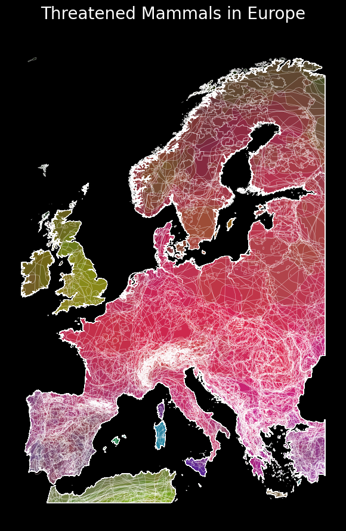

# 🦡 Threatened Mammals in Europe — Interactive Species Range Map

An interactive geospatial visualization mapping the range distributions of
threatened mammal species across Europe, built with Python and IUCN Red List
spatial data. Each species range is rendered as a uniquely colored polygon
outline, with full taxonomic metadata accessible via hover tooltips.

## 🗺️ How to Read the Map

### Line Density
Each line on the map represents the **boundary outline of a single species'
geographic range polygon**. Because hundreds of species ranges overlap
across the same territory, these outlines stack on top of one another.

The resulting mesh pattern is directly interpretable:
- **Dense, bright regions** — many species ranges overlapping simultaneously,
  indicating high threatened mammal richness (Central Europe, the Balkans,
  parts of Eastern Europe)
- **Sparse, faint regions** — fewer overlapping ranges, indicating lower
  threatened species density (British Isles, northern Scandinavia)

This emergent line density pattern functions as an implicit **biodiversity
pressure map** — the brighter and more tangled the mesh, the greater the
concentration of threatened mammal ranges in that area.

### Color
Each species is assigned a **unique color drawn sequentially from the HSV
spectrum**. The color carries no ecological or taxonomic meaning — its sole
purpose is visual differentiation, allowing individual species ranges to be
distinguished from one another when ranges partially overlap.

> ⚠️ Note: Color does not encode threat category, taxonomic order, or any
> biological variable. It is an index-based aesthetic assignment only.

## 🖱️ Interactive Features

Hovering over any polygon reveals the full species profile:
- Scientific name
- IUCN species ID
- Family and Order classification
- Red List threat category (VU / EN / CR)

## 🛰️ Data Source

- **IUCN Red List Spatial Data** — official species range polygons for
  mammals assessed as Vulnerable (VU), Endangered (EN), or
  Critically Endangered (CR)
- Filtered to the European extent using `geopandas` spatial operations

## 🧰 Tech Stack

| Tool | Purpose |
|---|---|
| `geopandas` | Spatial data loading and filtering |
| `folium` | Interactive Leaflet.js map rendering |
| `matplotlib` | HSV colormap generation for per-species coloring |
| `numpy` | Color normalization across species |
| CartoDB Dark Matter | Base tile layer for visual contrast |

## 🚀 How to Run

```bash
git clone https://github.com/YOUR_USERNAME/threatened-mammals-europe.git
cd threatened-mammals-europe
pip install geopandas folium matplotlib numpy
```

Download IUCN mammal range data from:
[https://www.iucnredlist.org/resources/spatial-data-download](https://www.iucnredlist.org/resources/spatial-data-download)

Then run:
```bash
jupyter notebook threatened_mammals.ipynb
```

Open `threatened_species_europe.html` in any browser for the
full interactive experience.

## 🌱 Why This Matters

Mapping the spatial distribution of threatened species is a foundational
step in conservation planning, protected area prioritization, and
biodiversity monitoring. The line density pattern that emerges from
overlapping species range boundaries directly reveals which regions face
the highest cumulative pressure from multiple threatened species
simultaneously — information critical for directing conservation
resources effectively.

## 📌 Key Observations

- **Central and Eastern Europe** display the densest line overlap,
  indicating the highest concentration of threatened mammal ranges
  on the continent
- **The Balkans** emerge as a pronounced biodiversity hotspot, driven
  by high endemism and narrow range distributions producing intense
  polygon overlap
- **The British Isles** show comparatively sparse line density,
  consistent with historical island-driven range contraction and
  lower threatened species richness
- **The Iberian Peninsula** contains several species with ranges
  restricted entirely within its boundaries, visible as isolated
  closed polygon outlines
